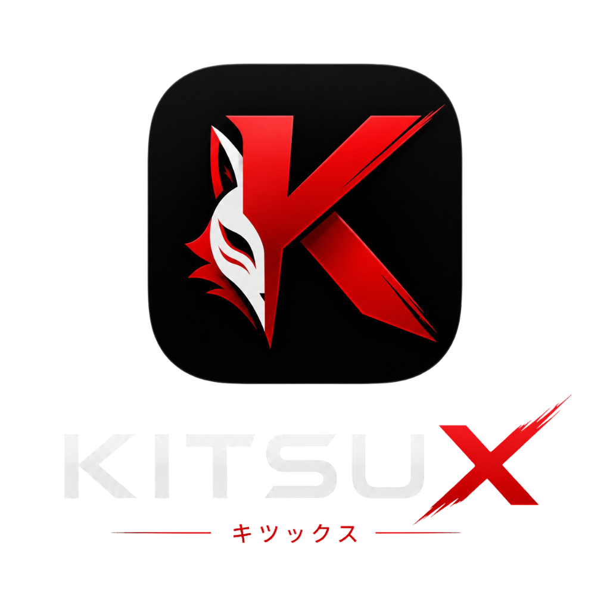

# Kitsu X

### Reproductor de anime y lector de manga optimizado para Android, basado en Mihon/Aniyomi.
*Descubre, reproduce y lee tu contenido favorito en una app fluida, automatizada y libre de bloqueos.*

---

[**🇪🇸 Español**](#-kitsu-x---español) | [**🇺🇸 English**](#-kitsu-x---english)

---

## 🇪🇸 Kitsu X - Español

Kitsu X es un fork moderno y optimizado de Aniyomi/Mihon para dispositivos Android. Aunque mantiene soporte completo para la lectura de manga, su diseño y optimizaciones están enfocados en brindar la mejor experiencia posible para la reproducción de anime, automatizando tareas cotidianas y resolviendo problemas históricos de la plataforma (como las verificaciones de Cloudflare y la descarga de extensiones).

---

<!-- START_DOWNLOADS_ES -->
### 📥 Descargas (Última versión: `v1.0.3`)

Para instalar Kitsu X, tu dispositivo debe contar con **Android 8.0 o superior**.

* **APK Universal**: [Descargar app-universal-release.apk](https://github.com/richtunic/Kitsu-X/releases/download/v1.0.3/app-universal-release.apk)
* **APK arm64-v8a**: [Descargar app-arm64-v8a-release.apk](https://github.com/richtunic/Kitsu-X/releases/download/v1.0.3/app-arm64-v8a-release.apk)
* **APK armeabi-v7a**: [Descargar app-armeabi-v7a-release.apk](https://github.com/richtunic/Kitsu-X/releases/download/v1.0.3/app-armeabi-v7a-release.apk)
* **APK x86**: [Descargar app-x86-release.apk](https://github.com/richtunic/Kitsu-X/releases/download/v1.0.3/app-x86-release.apk)
* **APK x86_64**: [Descargar app-x86_64-release.apk](https://github.com/richtunic/Kitsu-X/releases/download/v1.0.3/app-x86_64-release.apk)

*Para ver versiones anteriores o el historial completo de cambios, visita la sección de [Releases](https://github.com/richtunic/Kitsu-X/releases).*
<!-- END_DOWNLOADS_ES -->

---

### ✨ Características Exclusivas de Kitsu X

* 🤖 **Autocategorización Inteligente (Jikan API)**: 
  Organiza automáticamente tu biblioteca. Al agregar una obra o entrar a sus detalles, la app consulta la API de Jikan para clasificarla automáticamente por géneros en categorías personalizadas.
* 🥚 **Easter Eggs Divertidos**:
  ¿Buscas reírte un poco? Prueba buscando obras como "Rent a Girlfriend", "100 novias" o "quintillizas" en el buscador de la aplicación y recibe cómicos comentarios del equipo sobre tu amor propio y salud mental.

---

### ⚙️ Características Generales

* **Reproductor Avanzado**: Basado en `mpv-android`, con soporte para múltiples formatos de video, subtítulos avanzados (ASS/SSA), gestos de pantalla y ajustes de velocidad de reproducción.
* **Lector de Manga Personalizable**: Lector configurable con dirección de lectura configurable, filtros de color, modos de escala y visualización de doble página.
* **Sincronización con Trackers**: Vincula tus cuentas de [MyAnimeList](https://myanimelist.net/), [AniList](https://anilist.co/), [Kitsu](https://kitsu.app/), [Shikimori](https://shikimori.one/) y [Bangumi](https://bgm.tv/) para actualizar tu progreso automáticamente.
* **Copias de Seguridad**: Crea y restaura respaldos locales de tu base de datos para no perder tu biblioteca ni historial al cambiar de dispositivo.

---

### ☕ Apoya al Proyecto

Kitsu X se mantiene gracias al trabajo voluntario y las donaciones de la comunidad. Si valoras nuestro trabajo y quieres apoyar el desarrollo:

---

 

## 🇺🇸 Kitsu X - English

Kitsu X is a modern, optimized fork of Aniyomi/Mihon for Android devices. While it retains full support for manga reading, its design and enhancements are primarily focused on providing the best possible experience for anime playback, automating common tasks, and resolving long-standing platform issues (such as Cloudflare challenges and extension install hanging).

---

<!-- START_DOWNLOADS_EN -->
### 📥 Download (Latest version: `v1.0.3`)

To run Kitsu X, your device must have **Android 8.0 or higher**.

* **Universal APK**: [Download app-universal-release.apk](https://github.com/richtunic/Kitsu-X/releases/download/v1.0.3/app-universal-release.apk)
* **arm64-v8a APK**: [Download app-arm64-v8a-release.apk](https://github.com/richtunic/Kitsu-X/releases/download/v1.0.3/app-arm64-v8a-release.apk)
* **armeabi-v7a APK**: [Download app-armeabi-v7a-release.apk](https://github.com/richtunic/Kitsu-X/releases/download/v1.0.3/app-armeabi-v7a-release.apk)
* **x86 APK**: [Download app-x86-release.apk](https://github.com/richtunic/Kitsu-X/releases/download/v1.0.3/app-x86-release.apk)
* **x86_64 APK**: [Download app-x86_64-release.apk](https://github.com/richtunic/Kitsu-X/releases/download/v1.0.3/app-x86_64-release.apk)

*To see older versions or the changelog, check the [Releases](https://github.com/richtunic/Kitsu-X/releases) page.*
<!-- END_DOWNLOADS_EN -->

---

### ✨ Kitsu X Exclusive Features

* 🤖 **Smart Auto-Categorization (Jikan API)**:
  Organize your library automatically. Upon adding an entry or opening its details, the app queries Jikan API to automatically sort it into categories based on its genres.
* 🥚 **Funny Easter Eggs**:
  Looking for a laugh? Try searching for series like "Rent a Girlfriend", "100 Girlfriends", or "Quintuplets" in the global search and prepare for some witty commentary about self-respect and sanity from the Kitsu X team.

---

### ⚙️ General Features

* **Advanced Video Player**: Built on `mpv-android`, featuring support for custom sub-tracks, styling (ASS/SSA), swipe gestures, and playback speed control.
* **Customizable Manga Reader**: Configurable reader with custom directions, color filters, zoom modes, and dual-page display.
* **Tracker Integration**: Connect and auto-sync progress with [MyAnimeList](https://myanimelist.net/), [AniList](https://anilist.co/), [Kitsu](https://kitsu.app/), [Shikimori](https://shikimori.one/), and [Bangumi](https://bgm.tv/).
* **Backups**: Create local database backups to safely migrate your library and tracking history to new devices.

---

### ☕ Support the Project

Kitsu X is promoted through volunteer efforts and support from the community. If you enjoy the app and want to support its ongoing development:

---

## 🛠️ Contributing

Contributions are welcome! If you want to contribute code or report bugs, feel free to open a Pull Request or a GitHub Issue.

### License
Licensed under the Apache License 2.0. See the [LICENSE](./LICENSE) file for details.
