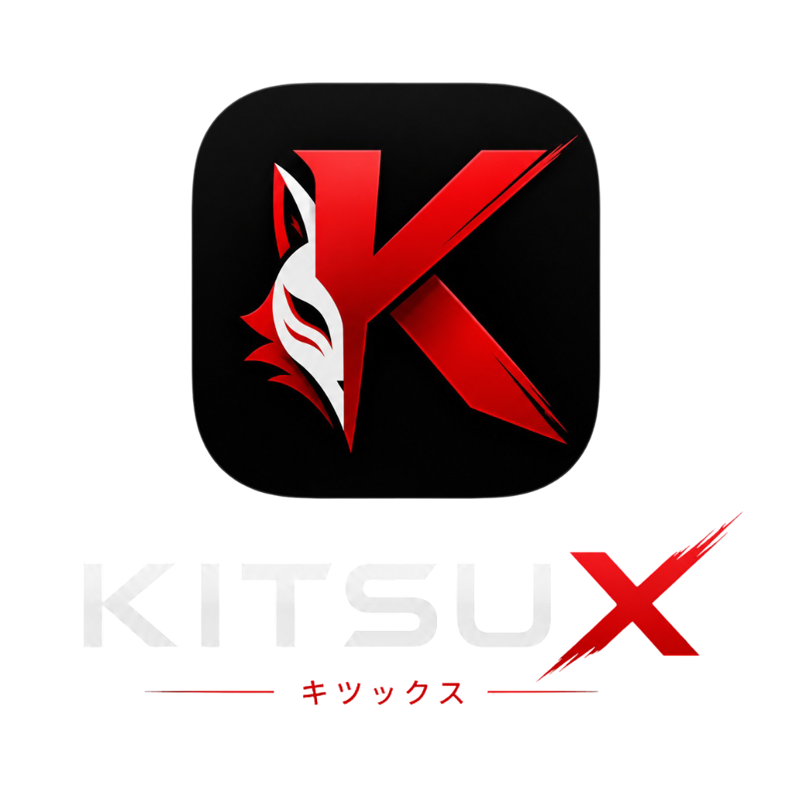
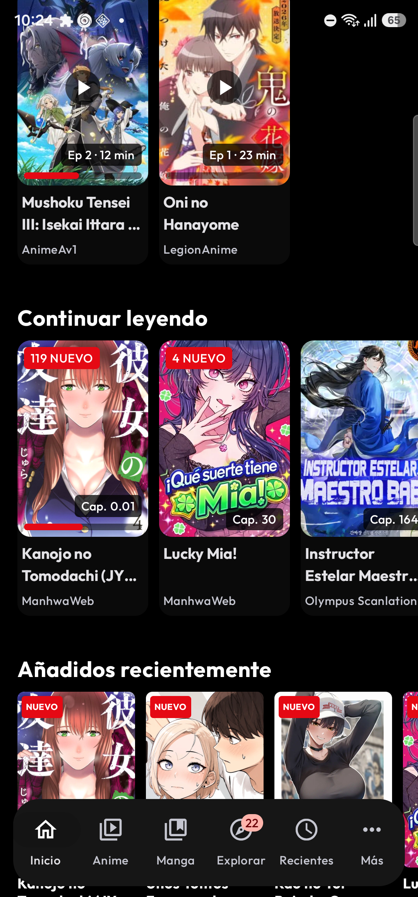
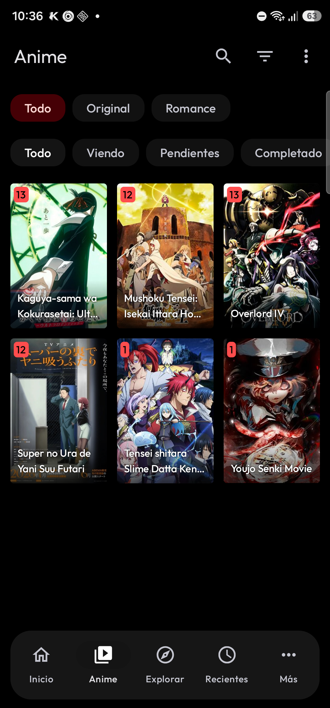
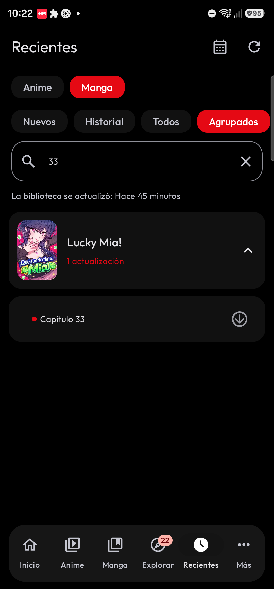

# Kitsu X

### Tu anime. Tu manga. Tu siguiente capítulo.

Una continuación independiente de Aniyomi, con una experiencia visual propia para Android.

[Español](#espanol) · [English](#english) · [Cambios en 1.1.0](docs/releases/1.1.0.md)

## Anime y manga, con una interfaz hecha para tus obras

**Kitsu X continúa la base de Aniyomi como un proyecto independiente**, conservando su reproductor, lector y sistema de extensiones, y desarrollando una interfaz propia para explorar, organizar y retomar tu biblioteca. El diseño pone las portadas al frente: tarjetas redondeadas, avance sobre la imagen, controles claros y navegación inferior flotante.

El proyecto parte del trabajo de [Aniyomi](https://github.com/aniyomiorg/aniyomi) y del ecosistema Tachiyomi/Mihon. Kitsu X mantiene su propio desarrollo; no es una versión oficial de Aniyomi.

### Así se ve Kitsu X

<table>
<tr>
<th>Portadas y progreso</th>
<th>Tu biblioteca</th>
<th>Recientes y búsqueda</th>
</tr>
<tr>
<td align="center"></td>
<td align="center"></td>
<td align="center"></td>
</tr>
<tr>
<td>Retoma un episodio o capítulo desde su portada.</td>
<td>Organiza tus obras y filtra lo que quieres ver.</td>
<td>Encuentra novedades e historial sin perderte entre listas.</td>
</tr>
</table>

*Capturas reales tomadas en un Samsung Galaxy S23 Ultra durante las pruebas del diseño de 1.1.0. Las obras y fuentes visibles pertenecen a la biblioteca de prueba; no vienen incluidas en la app. La navegación se adapta a los tipos de contenido habilitados en Ajustes.*

<!-- START_DOWNLOADS_ES -->
### Descargar e instalar

**Requisitos: Android 8.0 o superior y un sistema ARM de 64 bits (`arm64-v8a`).** Un procesador de 64 bits con Android de 32 bits no cumple este requisito.

[**Ver versiones publicadas y descargar el APK**](https://github.com/richtunic/Kitsu-X/releases)

La versión **1.1.0** se distribuye exclusivamente para `arm64-v8a`: no incluye APK universal, ARM de 32 bits ni x86/x86_64.
<!-- END_DOWNLOADS_ES -->

Para actualizar una instalación de Kitsu X, instala el APK sobre la versión existente. Crea un respaldo antes de actualizar y conserva la app instalada para mantener sus datos.

## Qué puedes hacer

### Inicio: vuelve a donde te quedaste

Inicio reúne **Continuar viendo** y **Continuar leyendo** a partir de tu biblioteca e historial. Cada tarjeta combina portada, título, fuente y la referencia del episodio o capítulo para reconocer rápidamente lo que estabas siguiendo.

El progreso forma parte de la portada: en anime puedes ver el avance del episodio; en las bibliotecas, los episodios vistos o capítulos leídos se representan con los datos disponibles. Las etiquetas de novedades ayudan a distinguir contenido pendiente. Cuando no hay un total conocido, la app evita presentar una barra como si la obra estuviera completada.

El destacado de Inicio utiliza obras de tu biblioteca y ofrece acceso para continuar. También puedes consultar los títulos añadidos recientemente.

### Anime y Manga: tu colección, a tu manera

Las bibliotecas separan ambos tipos de contenido y permiten organizar las obras en **categorías propias**. La vista **Todo** reúne la colección sin repetir una obra por estar en varias categorías.

Usa los filtros rápidos para revisar lo que estás viendo o leyendo, lo pendiente y lo completado. Los filtros y opciones avanzadas permiten ajustar el orden y la presentación. Puedes elegir entre las vistas de biblioteca disponibles y configurar las columnas de la cuadrícula.

Las fichas reúnen portada, información de la fuente, descripción, géneros y lista de episodios o capítulos. Desde ellas puedes continuar, gestionar la obra en tu biblioteca, acceder al seguimiento y descargar contenido compatible.

### Explorar: descubre, busca y administra tus fuentes

Explorar reúne cuatro páginas con tareas distintas:

| Página | Para qué sirve |
| --- | --- |
| **Descubrir** | Consultar anime de temporada, próximos estrenos y tendencias, y filtrar por género. Al elegir una obra puedes buscarla en tus fuentes instaladas. |
| **Buscar** | Elegir Anime o Manga, buscar un título en las fuentes del tipo seleccionado o abrir directamente una fuente instalada desde sus grupos desplegables. |
| **Extensiones** | Buscar, instalar y actualizar extensiones, revisar las instaladas y gestionar repositorios. Anime y manga se organizan por separado en grupos desplegables. |
| **Migraciones** | Acceder a las herramientas para trasladar obras de la biblioteca a otra fuente, con secciones separadas para anime y manga. |

Descubrir utiliza metadatos de **Jikan y AniList**. Su catálogo sirve para descubrir títulos; la disponibilidad para verlos depende de las fuentes instaladas. Los resultados guardados permiten mostrar contenido mientras se actualiza, y cada sección puede recuperarse sin bloquear las demás.

Las extensiones conectan la app con fuentes externas. Tú eliges los repositorios y extensiones que instalas. Las listas aprovechan el desplazamiento de toda la página para que puedas revisar los resultados sin quedar limitado a un panel pequeño.

### Recientes: novedades e historial en un mismo lugar

El reloj de la barra inferior abre Recientes. El selector **Anime/Manga** y los cuatro modos permiten decidir qué revisar:

- **Nuevos:** actualizaciones de la biblioteca con episodios o capítulos pendientes.
- **Historial:** lo que has reproducido o leído, con acceso para retomarlo.
- **Todos:** actualizaciones recientes, incluidas las de contenido que ya viste o leíste.
- **Agrupados:** actualizaciones organizadas por obra, con grupos que puedes expandir o plegar.

La búsqueda filtra la vista activa. Las fechas y los encabezados por obra ayudan a ubicar cuándo llegó una actualización y a evitar largas listas de entradas repetidas.

### Reproducción, lectura y descargas

El reproductor basado en **mpv-android** ofrece controles de reproducción, velocidad, gestos y opciones de audio y subtítulos según el contenido disponible. El lector permite configurar el modo y dirección de lectura, la escala, los filtros de color y la presentación de páginas.

Puedes descargar capítulos o episodios de fuentes compatibles para consumirlos sin conexión. La cola muestra progreso y permite pausar, reanudar y reintentar una descarga individual. Si algo falla, el diálogo muestra el detalle del error y permite copiarlo para reportarlo; los problemas de escritura indican que revises el permiso o la carpeta de almacenamiento.

Las descargas y la reproducción dependen de lo que ofrezca cada extensión y servidor.

### Actualizaciones de biblioteca, seguimiento y respaldos

- **Actualizaciones programadas:** configura cuándo comprobar nuevos episodios o capítulos. Las notificaciones resumen separan novedades, obras omitidas y errores.
- **Seguimiento:** vincula los servicios compatibles, como MyAnimeList, AniList, Kitsu, Shikimori o Bangumi, para registrar el progreso de las obras asociadas. Esto requiere configurar tu cuenta y vincular cada obra.
- **Respaldos:** crea y restaura copias de los datos de la app para conservar tu biblioteca y los datos incluidos en el respaldo. Los archivos de descargas se gestionan por separado.

### Apariencia y fluidez

Kitsu X utiliza una paleta propia con modos **Claro, Oscuro, Sistema y AMOLED**. Las portadas, fichas, categorías, controles y barra flotante siguen el mismo estilo.

El arranque evita una espera artificial, Inicio reduce consultas y procesa datos fuera del hilo de interfaz, y Descubrir reutiliza su caché. Las búsquedas cancelan solicitudes anteriores y permiten reintentar una fuente sin descartar los resultados de otras. Son mejoras concretas para reducir esperas; los tiempos de red siguen dependiendo de tu conexión y de cada proveedor.

## Primeros pasos

1. Instala una versión publicada compatible con tu dispositivo y completa la bienvenida.
2. En **Explorar → Extensiones**, configura tus repositorios e instala las fuentes que quieras usar.
3. Abre **Buscar**, elige Anime o Manga y encuentra una obra. Añádela a tu biblioteca y asígnale una categoría si lo deseas.
4. Reproduce o lee desde su ficha. Después puedes retomarla desde **Inicio** o **Recientes → Historial**.
5. Para descargar, configura una carpeta de almacenamiento y concede el acceso necesario. Activa el seguimiento y los respaldos desde sus ajustes si quieres utilizarlos.

## Ayuda y comunidad

Para reportar un problema, abre un [issue](https://github.com/richtunic/Kitsu-X/issues) e incluye versión de Kitsu X, versión de Android, fuente, obra, pasos y mensaje de error. Si la descarga permite copiar el diagnóstico, adjúntalo sin información privada.

Puedes participar en [Discord](https://discord.gg/uHY7TpZdZ) o apoyar el desarrollo en [Ko-fi](https://ko-fi.com/relampagonegr0).

---

## Your anime and manga, with a visual experience of their own

**Kitsu X continues the Aniyomi foundation as an independent project**, retaining its player, reader, and extension system while developing its own interface for exploring, organizing, and returning to your library. Rounded covers, progress displayed on the artwork, clear controls, and floating navigation bring your titles to the foreground.

The project builds on [Aniyomi](https://github.com/aniyomiorg/aniyomi) and the Tachiyomi/Mihon ecosystem. It is independently developed and is not an official Aniyomi release.

### A look inside

<table>
<tr><th>Covers and progress</th><th>Your library</th><th>Recents and search</th></tr>
<tr>
<td align="center"></td>
<td align="center"></td>
<td align="center"></td>
</tr>
</table>

*Real Samsung Galaxy S23 Ultra screenshots from testing the 1.1.0 design. Titles and sources belong to the test library and are not bundled with the app. Navigation adapts to the content types enabled in Settings.*

<!-- START_DOWNLOADS_EN -->
### Download and installation

**Requires Android 8.0 or newer and a 64-bit ARM Android system (`arm64-v8a`).** A 64-bit processor running 32-bit Android does not meet this requirement.

[**View published releases and download the APK**](https://github.com/richtunic/Kitsu-X/releases)

Version **1.1.0** is distributed exclusively as `arm64-v8a`, without universal, ARM 32-bit, or x86/x86_64 builds.
<!-- END_DOWNLOADS_EN -->

To update an existing Kitsu X installation, install the APK over it. Create a backup before updating and keep the app installed to retain its data.

## Features

### Home: pick up where you left off

**Continue watching** and **Continue reading** use your library and history. Cards show the cover, title, source, and episode or chapter reference. Anime cards display episode progress; library progress reflects watched episodes or read chapters when the required totals are available. Unknown totals are not presented as completed titles.

The featured title comes from your library and offers a way to continue. Recently added entries and badges for new content help you decide what to open next.

### Anime and Manga libraries

Organize titles into your own **categories** and use **All** to see the collection without duplicating titles assigned to multiple categories. Quick filters highlight ongoing, pending, and completed entries; advanced settings offer sorting and display options, including grid columns.

Detail pages bring together artwork, source information, descriptions, genres, and episode or chapter lists. They provide access to watching or reading, library management, tracking, and supported downloads.

### Explore

| Page | Purpose |
| --- | --- |
| **Discover** | Browse seasonal anime, upcoming releases, and trends, with genre filtering. Select a title to search installed sources. |
| **Search** | Choose Anime or Manga, search sources of that type, or open an installed source directly from expandable groups. |
| **Extensions** | Search, install, and update extensions, review installed extensions, and manage repositories, with separate anime and manga groups. |
| **Migrations** | Access tools for moving library entries to another source, organized separately for anime and manga. |

Discover uses **Jikan and AniList** metadata. A catalog entry does not guarantee availability in an installed source. Cached results remain useful during refreshes, and sections refresh independently. Extension lists scroll with the page rather than inside a small nested panel.

### Recents

The clock in the bottom bar opens Recents. Choose Anime or Manga and use one of four views:

- **New:** library updates with unwatched episodes or unread chapters.
- **History:** watched or read content that you can return to.
- **All:** recent updates, including content already watched or read.
- **Grouped:** updates organized by title in expandable groups.

Search filters the active view. Dates and title headings make it easier to find updates without scanning repeated entries.

### Player, reader, and downloads

The **mpv-android** player provides playback controls, speed adjustment, gestures, and audio/subtitle options supported by the content. The reader offers configurable reading modes and directions, scaling, color filters, and page presentation.

Download supported chapters or episodes for offline use. The queue shows progress and offers pause, resume, and individual retries. Error dialogs provide copyable details, with actionable storage messages when the app cannot write files. Playback and downloads depend on each extension and server.

### Library updates, tracking, and backups

Schedule checks for new chapters or episodes and review notifications summarizing new content, skipped titles, and errors. Connect supported trackers such as MyAnimeList, AniList, Kitsu, Shikimori, or Bangumi and link titles to record progress.

Create and restore backups of app data to preserve your library and the data included in each backup. Downloaded media files are managed separately.

### Appearance and performance

Kitsu X has its own palette and **Light, Dark, System, and AMOLED** modes. Covers, detail pages, categories, controls, and floating navigation follow a shared visual style.

Startup avoids an artificial delay, Home reduces queries and processes data away from the UI thread, and Discover reuses cached content. Searches cancel previous requests and support retrying one source while retaining other results. Network response times still depend on your connection and providers.

## Getting started

1. Install a compatible published release and complete onboarding.
2. Configure repositories and install sources in **Explore → Extensions**.
3. Open **Search**, choose Anime or Manga, find a title, and add it to your library.
4. Watch or read from its detail page, then return through **Home** or **Recents → History**.
5. Configure a storage folder and grant the required access for downloads. Set up tracking and backups if you want to use them.

## Support and contribution

Report problems through [GitHub Issues](https://github.com/richtunic/Kitsu-X/issues), including app and Android versions, source, title, reproduction steps, and the error message. Remove private information from copied diagnostics. Contributions are welcome through pull requests.

Join [Discord](https://discord.gg/uHY7TpZdZ) or support development on [Ko-fi](https://ko-fi.com/relampagonegr0).

## Credits and license

Kitsu X builds on the work of the Aniyomi, Mihon, and Tachiyomi communities and their contributors. Content is supplied by user-installed sources; Kitsu X does not host or bundle anime or manga.

Licensed under [Apache License 2.0](LICENSE).
